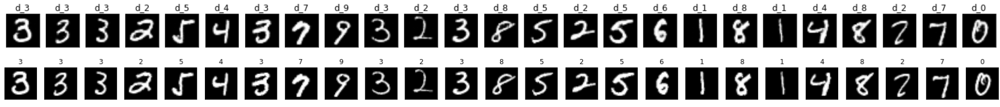

## Autoencoders
These are very useful models that consist of an encocder and a decoder block. The main applications of autoencoders are image compression and decompression, image de-noising, etc.

## Table of Contents

1. Linear Autoencoders
2. Convolutional Autoencoders

## 1. Linear Autoencoders

### Model Architecture

 

* The basic architecture of a Autoencoder is described by the diagram above. 

* In this notebook we are using the MNIST dataset to compress the 28x28 images and decompress them back to the original image. The architecture of the model used in this project is described below. 

 

### Results

#### Note
All these models are trained for 5 epochs. 

* Considering an encoding depth of 32

 

* Considering an encoding depth of 64

 

* Considering an encoding depth of 128

 

* Considering an encoding depth of 256

 

### Conclusion

From the above results we can conclude that more the encoding depth better is the resolution of the reconstructed image. But we have to remember that more the encoding depth lesser is the compression. So, while building an autoencoder for image / audio compression we have to choose an optimial encoding depth for best compression and recovery. 

## 2. Convolutional Autoencoders

The linear autoencoders could get the job done but they are not really efficient. So, we use convolutional autoencoders that consists on an encoder block and a decoder block. The encoder is mainly a combination of convolutional layers and maxpool layers and the decoder consists of transpose convolutional layers. This has a greater efficiency compared to the normal autoencoders as convolutional operations reduce the dimensions of the image more efficiently. 

### Model Architecture

 

* The basic architecture of a Autoencoder is described by the diagram above. 

* In this notebook we are using the MNIST dataset to compress the 28x28 images and decompress them back to the original image. The architecture of the model used in this project is described below. 

 

* Here Tconv stands for transpose convolution or deconvolution. 

* Both the input and output dimensions are 28x28. (MNIST images)

* The exact model architecture is described  below: 

ConvAutoencoder(  
  (conv1): Conv2d(1, 64, kernel_size=(3, 3), stride=(1, 1), padding=(1, 1))  
  (conv2): Conv2d(64, 8, kernel_size=(3, 3), stride=(1, 1), padding=(1, 1))  
  (pool): MaxPool2d(kernel_size=2, stride=2, padding=0, dilation=1, ceil_mode=False)  
  (t_conv1): ConvTranspose2d(8, 64, kernel_size=(2, 2), stride=(2, 2))  
  (t_conv2): ConvTranspose2d(64, 1, kernel_size=(2, 2), stride=(2, 2))  
)  

### Results

With the above architecture after training the model for 30 epochs the output is: 

 

